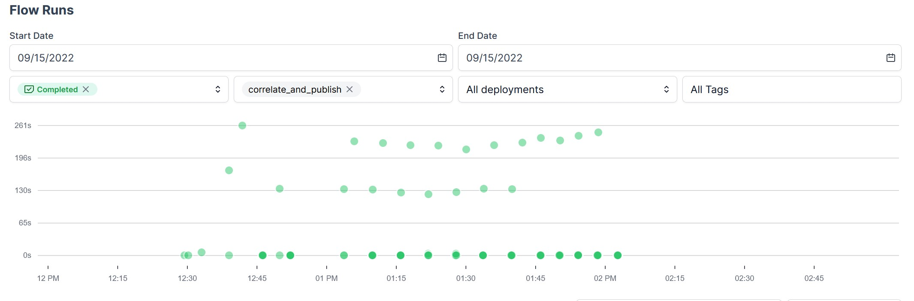

# Noisy Stocks

Generates spurious stock correlations between stock price and rainfall based on historical movers & shakers.

Published online on [noisystocks.com](https://www.noisystocks.com/).

## General information

My original intention was to create a Cloud Native architecture (Container-Based + Dynamically-Scalable + Microservice-Oriented). Upon closer reflection, running in the cloud would not improve the rainfall calculations and instead add unneeded complexity. The project thus uses a local architecture with decoupled services & materialized outputs. The services are:

* Analysis service (Custom Python 3 using Pandas DataFrames & Prefect 2.0, exports to pickle)
* Correlation ingestion service (Imports correlations + metadata from pickle, exports into custom website database)
* Publishing service (Export website database content to markdown)
* Static Site Generation service (Hugo)

Databases are PostgresQL specialized for time series (Timescale)

Features:

* Blazing fast. Can process 60+ stocks to a fully published state in less than 5 minutes.

* Automatically finds correlations based on time series

* Optimized Big Data database
	- more than 870 million weather & 14 million stock datapoints
	- 90+% compression rate

* Decouples back-end & front-end securely using Jamstack architecture.

* Strongly typed Python using Pydantic & Pandera to increase reliability

* Fully idempotent. No matter how many times you run the program with the same arguments, the result will be as if it only ran once. A very useful property in case your computer loses power suddenly.

* DevOps best practices: 
	* Continuous Integration
	* Continuous Deployment
	* Package management inside reproducable virtual environment (Poetry package manager)

# Requirements
 
There were a couple interesting problems that needed to be solved by the program:

- Time series data is intrinsically challenging because a calendar year (365 days + leap day roughly every 4 years) does not align exactly with an astronomical year on earth ([365.2422 days](https://pumas.nasa.gov/sites/default/files/examples/04_21_97_1.pdf)). Furthermore, you need to take into account timezones.
- When you correlate two time series datasets, how do you ensure the time series data is aligned? How do you handle missing datapoints?
- Financial markets can be closed due to the weekend or holidays. If you go back an arbitrary amount of days, how can you get the most usable time series range selection?

# Performance Chart
I precomputed the correlations for three months. You can see the chart of the whole process here:

# Limitations:

## Encapsulation
To maintain a good overview, functionality should be enclosed in subfunctions. For most functions, I was able to enclose them. However, the Prefect Orion 2.0 beta orchestrator faces issues with passing some kinds of arguments (eg. an sqlalchemy engine, a pickle containing deeply nested dictionaries & dataframes). Prefect 2.0 beta seems to make the implicit assumption that any subflow should be cloudpickled & materialized. The temporary workaround was to simply inline the functionality. Not ideal, but for now it works. 

## Publish date scheduling

A subtle issue to explain. I'll try my best: The correlator finds the largest usable timerange near the target date, even if no datapoints are found ON the target date. However, this brings the problem that multiple target dates lead to the same usable timerange. The question thus becomes: How can you differentiate when a blog post should be published if they all return the same usable timerange?

WORKAROUND: Assign publish dates randomly and ensure the program runs chronologically.

## Database Representation
Currently, a datapoint has to be uniquely identified by a (longitude, latitude) composite key. However, for maximum flexibility, the program should also be able to uniquely identify datapoints which are not geocoordinates on earth. In principle, any numeric column of a dataset could be linked to a numeric col of a stock. 

Solved sub-problems:
- The Python correlation program is already adapted to compare any arbitrary numeric columns between two datasets. It can also handle one (or multiple) unique identifiers of the dataset during analysis and unfolds them during sql export.
- The database will change over time. How can you ensure that the results are reproducable?
	- Solution: Materialize all relevant export info and save the filename + hash in the database. The materialization of the final result is remarkably small (<1kb per correlation pair on a 5-day time range)

Unsolved sub-problems:
- In a database, how can you uniquely represent an entry of a dataset which might be composed of one, or multiple keys?
eg. (longitude, latitude) composite key, or (planet_name, longitude, latitude)

# Considerations:

* To keep the performance of queries reasonable, there should be one table per Big Data dataset. Each table requires a minimum of 3 fields:
	* timestamp with timezone
	* uid (eg. composite key made of longitude + latitude)
	* float value to correlate

* The program is only intended to run locally. To run it in the cloud, it will require several changes eg. using environment variables for passwords, error handling logic in case of network unavailability, etc.
 
* During development I became fascinated with the potential of Kubernetes. However, high availability architectures, such as provided by Kubernetes, add complexity & resource overhead. In my case, high availability is not a critical requirement for the back-end services. Why? Because the uptime of the website is NOT impacted by downtime of the back-end services. If the back-end services are down it will only affect the freshness of the content.

In the future I do intend to explore Kubernetes more.

# Reflection

* In general I am satisfied with the program. It runs fast and the code is reasonably elegant. However, it is made for a very specific purpose & expanding it beyond this original purpose could be difficult. At the start I tried to maximize flexibility & reliability, but as the deadline approached the code took a drop in quality. The later portions are less tested and more tightly coupled. eg:
	* The TimeSeries class method pivot_to_table has side effects; it changes the representation of TimeSeries which will break other methods. Furthermore, throughout the program, attributes are often accessed directly instead of abstracted behind a more error-proof interface.
* Prefect Orion is useful for observability into programs & running them on a schedule. However, it is still clearly in beta. During development I had disk storage issues, timeouts, pickling issues & cryptic errors. The Prefect team is aware of these issues and questions asked on the Slack are promptly answered. When it's out of beta, it could be a great data orchestration platform.
* It is challenging to decide on the _right_ size of a microservice.
* Intentions to run code in the cloud don't always turn into a reality. It's important to consider the actual benefits from running in the cloud. Not just to pad your CV with a badly-fitting technology.

# Troubleshoot

Is the Python dev tools binary installed for your specific python version? Debian-based system command:

	
	sudo apt-get install python3.10-dev